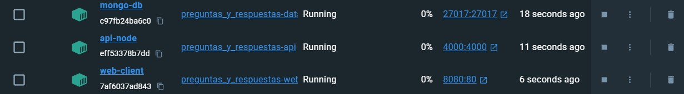
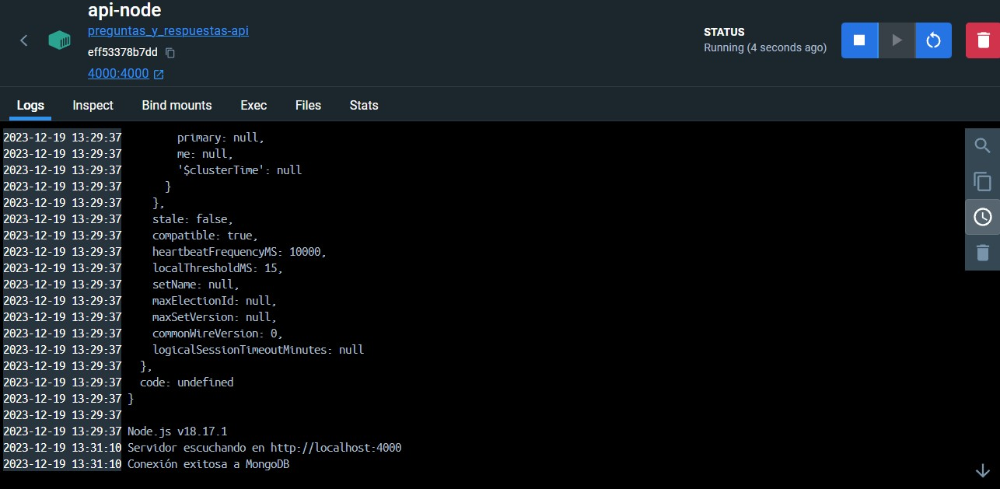
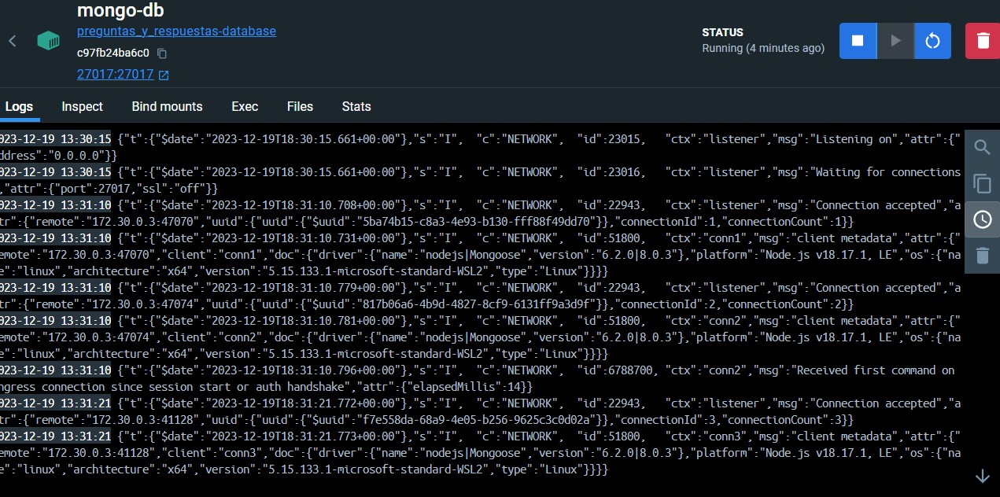
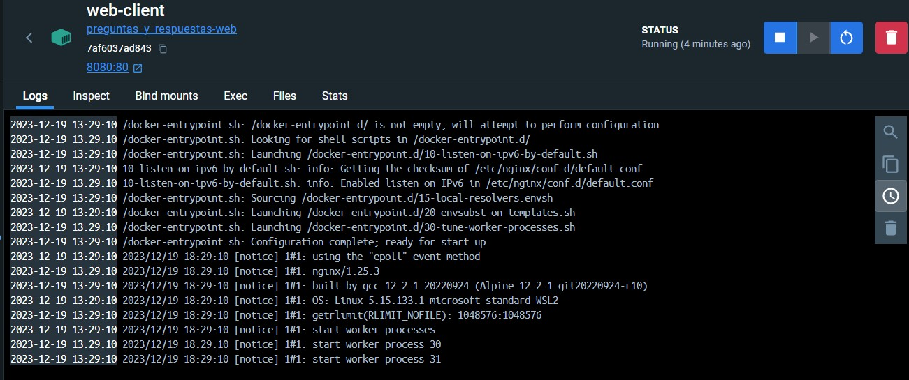

# Preguntas_y_respuestas

Este microservicio es una aplicación de lista de preguntas, que permite a los usuarios crear y visualizar preguntas. Esta aplicación utiliza Node.js y Express para el backend, MongoDB como base de datos. Además, utiliza Docker para la contenerización de la aplicación y su despliegue.

## Características

- Creación y visualizaciónde de preguntas.
- Interfaz de usuario sencilla y fácil de usar.
- Contenerización completa utilizando Docker.

## Estructura del Proyecto

- **`app.js`**: Archivo principal del servidor Node.js.
- **`index.html`**: Página principal del frontend.
- **`Dockerfile`**(para cada servicio): Define cómo construir cada contenedor.
- **`docker-compose.yaml`**: Configura los servicios necesarios para ejecutar la aplicación.
- **`init.js`**: Script de inicialización para la base de datos MongoDB.
- **`package.json`**: Archivo de configuración de Node.js.
- **`package-lock.json`**: Archivo de configuración de Node.js.

# Endpoints de la Aplicación Lista de Tareas

Esta tabla proporciona una descripción de los endpoints disponibles en la aplicación Lista de Tareas.

| Método | Endpoint      | Descripción                              | Cuerpo de la Petición                                                                        | Respuesta Esperada                  |
|--------|---------------|------------------------------------------|----------------------------------------------------------------------------------------------|-------------------------------------|
| GET    | `/preguntas`     | Obtiene todas las preguntas.                | N/A                                                                                          | Lista de todas las tareas.          |
| POST   | `/preguntas`     | Crea una nueva pregunta.                    | `{ "titulo": "Título", "description": "Descripción" }`                                       | Detalles de la pregunta creada.        |

Cada endpoint interactúa con la base de datos MongoDB para realizar las operaciones CRUD (Crear, Leer) en las preguntas.

## Contenedores de la Aplicación Lista de Tareas
Esta aplicación utiliza tres contenedores de Docker para ejecutar la aplicación.


## Contenedor de api

El contenedor de la API contiene el código de la aplicación Node.js y se ejecuta en el puerto 4000.



## Contenedor de MongoDB

El contenedor de MongoDB contiene la base de datos MongoDB y se ejecuta en el puerto 27017.


## Contenedor de web

El contenedor web contiene el código HTML/CSS/JavaScript de la aplicación frontend y se ejecuta en el puerto 8080.



## Requisitos Previos

Para ejecutar este proyecto, necesitarás tener instalado Docker y Docker Compose en tu máquina. Si no tienes Docker
instalado, puedes descargarlo de [Docker](https://www.docker.com/products/docker-desktop).

## Instalación y Ejecución

1. Clona el repositorio:
   ```bash
   git clone https://github.com/Desarrollo-de-software-III/Preguntas_y_respuestas.git
   cd Preguntas_y_respuestas
   ```
   
2. Construye la imagen de Docker:
   ```bash
    docker-compose up --build
    ```

Una vez que los contenedores estén en ejecución, la aplicación estará disponible.

## Uso

- Abre tu navegador y ve a http://localhost:8080.
- Utiliza la interfaz para agregar preguntas.

